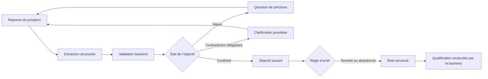

# Phase 6 — Scénarios métier obligatoires

Statut : terminée le 11 août 2026.

## Pourquoi ces tests

Les tests unitaires vérifient une règle isolée. Un scénario métier vérifie qu’une histoire complète traverse correctement les questions, l’état, la qualification et le brief. Le fournisseur `mock` rend ces parcours déterministes et évite tout appel réseau.

## Parcours général

## Matrice de couverture

| Scénario | Comportement attendu | Preuve principale |
|---|---|---|
| Plus de leads, peu de marketing | `none` est un canal valide et aucun canal n’est inventé | but et canaux présents dans le brief |
| Meta Ads, ROAS en baisse | le problème et le canal restent factuels | `paid_media` et baisse du ROAS conservés |
| Rebranding après acquisition | l’événement déclencheur et le besoin restent liés | acquisition + `branding` dans le brief |
| Budget incompatible | décision commerciale déterministe | maximum sous le seuil de l’organisation → `unqualified` |
| Agence actuelle ou précédente | aucune critique générée | réponse conservée textuellement et sobrement |
| Réponse vague | le moteur ne confirme pas trop tôt | même objectif reposé avec une précision demandée |
| Contradiction obligatoire | la contradiction passe avant les inconnues | raison `required_objective_contradiction` |
| Abandon | le travail déjà fait n’est pas perdu | brief créé, réponses conservées, reste `incomplete` |

## Règle de qualification

L’ordre est volontaire :

1. contradiction obligatoire → `follow_up`;
2. information obligatoire manquante → `follow_up`;
3. dossier complet avec budget maximal sous le seuil configuré → `unqualified`;
4. tous les objectifs obligatoires confirmés → `priority`.

Le modèle ne choisit pas librement ce classement. Le backend le recalcule et rejette un brief dont la qualification ne correspond pas.

## Limite assumée

Le seuil de **2 500 $ CA** est la valeur initiale du pilote, pas une vérité universelle. Chaque agence peut le modifier dans les paramètres; **0 $** désactive le filtre budgétaire. Les scénarios automatisés conservent 2 500 $ comme valeur par défaut reproductible.
