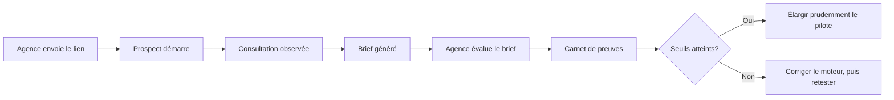

# Phase 7 — Protocole de tests terrain

Statut : dispositif logiciel prêt le 11 août 2026. La campagne réelle reste à mener.

## Principe

Une simulation peut vérifier le code, mais pas l’acceptation humaine. Les résultats de cette phase doivent provenir de vrais prospects et de membres d’agences qui utilisent les briefs pour préparer une rencontre.

## Cohorte pilote recommandée

- au moins 3 agences marketing boutique;
- au moins 15 consultations démarrées au total;
- au moins 5 consultations observées en direct avec consentement;
- un rôle agence identifié sans enregistrer le nom du réviseur;
- une revue remplie immédiatement après la lecture du brief.

Ces nombres sont des minimums opérationnels pour détecter des problèmes répétés, pas une validation statistique définitive.

## Déroulement d’une observation

1. expliquer que le produit est testé et obtenir le consentement;
2. laisser le prospect avancer sans aide tant qu’il n’est pas bloqué;
3. noter uniquement les moments de confusion, répétitions et suivis utiles;
4. ne pas enregistrer de nom, courriel ou détail personnel dans les notes;
5. laisser l’agence lire le brief avant la rencontre humaine;
6. remplir la revue dans le dossier de consultation;
7. vérifier `/app/field-tests` après chaque bloc de cinq consultations.

## Mesures automatiques

- invitations créées;
- taux de démarrage;
- taux de complétion parmi les consultations démarrées;
- taux d’abandon parmi les consultations démarrées;
- durée médiane des parcours terminés ou interrompus;
- nombre moyen de questions auxquelles une réponse a été enregistrée.

## Évaluation humaine

- compréhension sans assistance;
- impression de conversation plutôt que formulaire statique;
- absence de répétition évidente;
- pertinence des questions de suivi;
- absence de conseil, promesse ou critique interdite;
- utilité du brief sur 5;
- capacité du brief à préparer la rencontre sur 5;
- volonté de l’agence d’utiliser ce brief dans son processus.

## Seuils pilotes de décision

| Indicateur | Seuil provisoire |
|---|---:|
| Démarrage | au moins 70 % des invitations |
| Complétion | au moins 70 % des consultations démarrées |
| Durée médiane | 12 minutes ou moins |
| Brief utile | au moins 80 % avec une note de 4 ou 5 |
| Adoption agence | au moins 70 % répondent oui |
| Compréhension, conversation, répétition et suivis | au moins 80 % favorables |
| Respect des garde-fous | 100 % |

Les seuils sont des hypothèses de pilotage. Ils doivent être relus avec la taille de l’échantillon et les notes qualitatives, jamais interprétés seuls.

## Règle d’arrêt produit

Ne pas ajouter documents, voix, avatar, paiement ou automatisations complexes tant que les échecs récurrents du moteur ne sont pas compris. Un seul incident de garde-fou doit être analysé avant de poursuivre le pilote.
